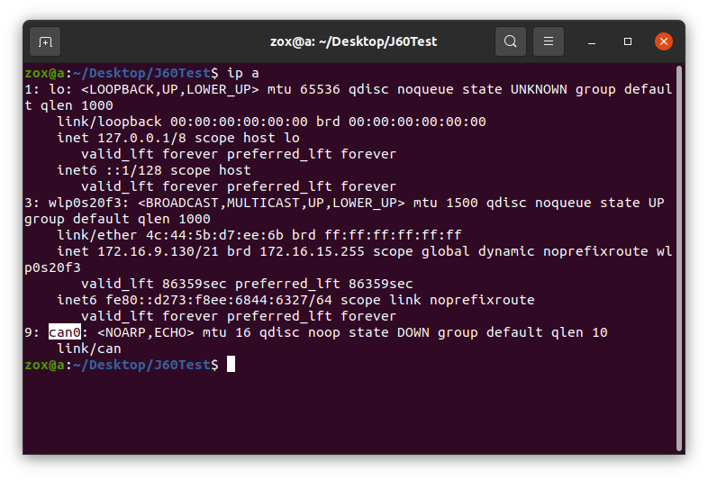

# Deep_Motor_SDK

SDK提供了can通讯、关节使能、关节控制等功能，并在example文件夹中提供了单关节控制single_motor和多关节控制multi_motor的例程。app文件夹中是关节调试工具软件，分别适用于Windows平台和Linux平台，可参考产品手册进行使用。

## 1 环境依赖
目前仅支持在Linux系统中编译运行。

## 2 例程的编译和运行
### 2.1 检查can口通道
例程原始代码中默认使用的can接口为can0，在运行例程前请先在终端中输入`ip a`，以获取实际使用设备的can接口名称。



如果所使用的设备的can接口不是can0，请在例程代码中将can0修改为实际的通道。
```c
DrMotorCan *can = DrMotorCanCreate("can0", true);
```
同时需要将/scripts/set_up_can.sh中的can0改为实际的接口名称。
```shell
sudo ip link set can0 type can bitrate 1000000
sudo ip link set can0 up
```

### 2.2 修改CAN ID
关节默认的id为1。
single_motor例程默认会与`motor_id = 1`的关节进行通信，若与实际的关节id不符，请在代码中将motor_id修改为实际的关节id。
```c
uint8_t motor_id = 1;
```
multi_motor例程默认会与motor_id为1~2的关节进行通信，若与实际的关节id不符，请在代码中进行相应的修改。

### 2.3 编译
example文件夹中已提供了可执行文件single_motor和multi_motor。若对原始的例程代码进行了修改，则需要在/Deep_Motor_SDK路径下打开一个终端中，在终端中输入`./script/compile.sh`命令重新编译例程代码。

### 2.4 运行
#### 2.4.1 设置并启动can设备
在/Deep_Motor_SDK路径下打开一个终端，在终端中输入`./script/set_up_can.sh`命令以设置can波特率并启动can设备。
#### 2.4.2 运行single_motor
在/Deep_Motor_SDK路径下打开一个终端，在终端中输入`./single_motor`命令以运行可执行程序single_motor，对应的关节将会持续转动，直至ctrl+c关闭终端。
#### 2.4.3 运行multi_motor
在/Deep_Motor_SDK路径下打开一个终端，在终端中输入`./multi_motor`命令以运行可执行程序multi_motor，对应的所有关节将会持续转动，直至ctrl+c关闭终端。

## 3 SDK的使用方法
在使用SDK编写代码的过程中，可参考example，将其include到代码文件中。
```c
#include "../sdk/deep_motor_sdk.h"
```
参考single_motor.c，可使用SDK实现以下一些功能：
### 3.1 创建can总线设备
```c
//不显示日志
DrMotorCan *can = DrMotorCanCreate("can0", false);

//显示日志
DrMotorCan *can = DrMotorCanCreate("can0", true);
```

### 3.2 给特定id的关节发送使能命令
```c
uint8_t motor_id = 1;
SetNormalCMD(motor_cmd, motor_id, ENABLE_MOTOR);
SendRecv(can, motor_cmd, motor_data);
```

### 3.3 创建线程检查特定关节的工作状态
```c
void *MotorStateCheckThreadFunc(void *args){
    MotorCheckThreadParam *params = (MotorCheckThreadParam *)args;
    MotorCMD *motor_cmd = MotorCMDCreate();
    MotorDATA *motor_data = MotorDATACreate();
    SetNormalCMD(motor_cmd, params->motor_id, GET_STATUS_WORD);
    while(!break_flag){
        int ret = SendRecv(params->can, motor_cmd, motor_data);
        CheckSendRecvError(params->motor_id, ret);
        CheckMotorError(params->motor_id, motor_data->error_);
        sleep(1);
    }
    MotorCMDDestroy(motor_cmd);
    MotorDATADestroy(motor_data);
    printf("[INFO] motor_state_check_thread for motor with id: %d stoped\r\n", (uint32_t)params->motor_id);
}

pthread_t thread_id;
MotorCheckThreadParam param;
param.can = can;
param.motor_id = 1;
if(pthread_create(&thread_id, NULL, MotorStateCheckThreadFunc, (void*)&param) != 0){
    fprintf(stderr, "Failed to create thread.\n");
    return 1;
}
```

### 3.4 给特定id的关节发送控制命令
```c
SetMotionCMD(motor_cmd, motor_id, CONTROL_MOTOR,0,0,0.3,0,0);
ret = SendRecv(can, motor_cmd, motor_data);
CheckSendRecvError(motor_id, ret);
```

### 3.5 失能关节
```c
SetNormalCMD(motor_cmd, motor_id, DISABLE_MOTOR);
SendRecv(can, motor_cmd, motor_data);
```

### 3.6 回收资源
```c
DrMotorCanDestroy(can);
MotorCMDDestroy(motor_cmd);
MotorDATADestroy(motor_data);
```